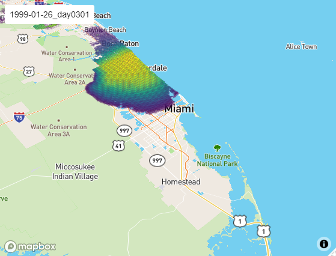

```{r xaringan-themer, include=FALSE, warning=FALSE}
library(xaringanthemer)

style_duo_accent(primary_color = "#FA4616", secondary_color = "#0021A5"
                  #text_font_google   = google_font("Fira Sans"),
                  #code_font_google   = google_font("Fira Mono")
)
```


```{r setup, echo=TRUE, include=FALSE}
options(htmltools.dir.version = FALSE)

Sys.setenv(`_R_S3_METHOD_REGISTRATION_NOTE_OVERWRITES_` = "false")

knitr::opts_chunk$set(echo = FALSE)
sample <- readRDS("R/sample.rds")

library(terra); library(sf); library(mapdeck); 
library(stars); library(raster)
mapdeck::set_token("pk.eyJ1IjoibmNzaXplbW9yZSIsImEiOiJjazVweGhua3UwYWg2M2Ryem1iazllMzQzIn0.UnEMbbyS2sg-ygD8saJqQQ")


```


class: center, middle, inverse

# Overview

???

- Thank you all for coming to this special tropical storm edition of my PhD defense :)
- Hopefully we'll be able to get everything done today that we need to
- Let's not waste time. Jumping right in, the work I'm discussing today concerns
a model we've been developing that describes the historical spread of HLB (citrus greening disease) in the state of Florida.
- Going to start with a quick overview of what HLB is, and the various challenges involved in modeling the spread.

---

# HLB

[Huanglongbing](https://en.wikipedia.org/wiki/Citrus_greening_disease) (黃龍病), aka citrus greening disease

- Worldwide vector-borne disease affecting citrus
- Devastating bacterial infection: infected trees produce unusable green fruit, die early, and are economically unviable
- Vectored by *D. Citri* (psyllids); transmits to most commercial citrus cultivars (including ornamental orange jasmine)

.pull-left[
```{r, out.width="75%", echo = FALSE}

```
]

.pull-right[
```{r, out.width="90%", echo = FALSE}
knitr::include_graphics("figures/greened_citrus.png")
```
]

???
- HLB stands for huanglongbing, but is commonly known as citrus greening disease
- Known for at least 100 years
- possibly originated in India or China
- only recently (2000s) reached the Americas
---
# HLB in Florida

- spread rapidly statewide due to pre-existing vector population
- caused major disruption to the industry

### Economic consequences
- 49% reduction in citrus production
- thousands of jobs
- $\approx$ $1 billion per year estimated impact

.center[
```{r, out.width="40%", echo = FALSE}
knitr::include_graphics("figures/psyllid.jpg")
```
]

???

- For this work, focused specifically on the recent invasion/devastion in Florida
- Note that similar consequences have been observed worldwide in other regions

---
# Timeline of key events

Some known, some informed conjecture:

- Early 1998: **Invasion**
  - Uninfected psyllids arrive to SE Florida (Palm Beach County)
- 1998-99: **Dispersal**
  - Uninfected psyllids continue dispersing urban corridor of SE Florida, reaching Homestead
- $\leq$ early 2000s: **Disease arrival**
  - Small number of *C*Las-positive plants arrive to Homestead
- Early 2000s: **Disease acquisition**
  - Psyllids acquire *C*Las in Homestead
  - Widespread, statewide dispersal of uninfected psyllids (heavy infestation of commercial groves)
  - Initial spread of *C*Las


???

- Key milestone: reaching Homestead, a major national center for nursery production of citrus
- Evidence suggests that vector encountered the disease at Homestead

---
# Timeline of key events

- Mid 2000s: **Disease spread**
  - Statewide dispersal of infection faciliated by plant sales and truck traffic
- 2005: **Detection**
  - First finding of *C*Las in Florida
- By 2009: **Devastation**
  - Widespread visible symptoms of infection and large blocks of citrus removed from production statewide


???

- Unclear exactly when acquistion occurred


---
# Objectives

To mitigate risk in other locales, eg. CA, TX, AZ, need a more cohesive understanding of what happened (relative significance of factors driving the spread).

### Challenges

- high-dimensional system acting over large and varied spatial and temporal scales
- many underlying processes which are individually complex
- sparse, irregularly collected data (historical) 
  - not intended for rigorous analysis
- gaps in biological understanding
- undocumented management practices
- and many others...

???

- Primary goal: understand what happened to help prevent it from happening again

- our challenges are common challenges that modelers must face

---
# Objectives

- This makes precise quantitative model validation/parameter estimation unfeasible 

- But the timeline offers constraints on the set of possible models

## Goal

- Comprehensive, realistic model with a small number of biologically-plausible assumptions that reproduces the spread


???

- This motivates the development of a comprehensive, realistic model that uses a minimum of biologically-plausible assumptions to qualitatively reproduce the spread.

- this is our goal, and we've made some good progress towards achieving it

---
class: inverse, center, middle

# The Model

???

- Let's describe the basic formulation and assumptions of the model
---

# Overview

### Philosophy

- Make a limited number of biologically defensible assumptions (i.e. consistent with the known timeline) to describe the underlying processes 

### Structure/scope 

- essentially a restatement of our goals, but to describe the philosophy driving our model

- Stochastic; spatially explicit; discrete time/space

- Captures all major relevant processes occurring statewide
  - From vector arrival in 1998 until major loss of productive crop (through $\approx$ 2010)
  
???

- Primarily stochastic with some deterministic approximations
- Avoid overly complex mechanistic detail
  
---
# Overview

### Spatial Resolution

- 0.25 $\times$ 0.25 mi (40 acre) grid overlaying the state; 1-acre resolution in commercial groves

- Partition statewide grid:
  1. urban/developed areas
  2. citrus areas (eg. commercial groves)
  3. areas with no host material/inhospitable to psyllids (vectors)

- Fundamental time unit: days


???

- 40 acre scale works well generally; higher density of host material in commercial groves suggests a higher resolution may be more appropriate in those areas

---
# Model components

Key processes captured by the model include:

| Mechanism    | Implementation Details |
| ----------- | ----------- |
| Psyllid demography |  Seasonal (monthly) variation based on location and historical temperature data |
| "Natural" psyllid movement  | Convolution with local kernel; separate dispersal patterns in urban areas and commercial groves |
| Sales of citrus plants and hedges statewide to retail stores and consumers  | Fixed store locations; two-stage/layered Poisson process based on regional population; store-specific sales distributions   |

???

- Demographic parameters are spatially explicit functions of location within the grid
- Natural movement is not stochastic due to the inevitable size of vector population in the billions
- Homestead, FL is a major center for nursery production and distributes plants statewide

---
# Model components


| Mechanism    | Implementation Details |
| ----------- | ----------- |
| Dispersal of psyllids via trucks to commercial processing plants | Seasonal harvesting process based on citrus density; routes sampled uniformly along paths to facilities |
|Infection to removal from production | Time to visible symptoms $+$ Time to removal |

???


---
# Demography

Parameters vary spatially according to the partition and are adjusted monthly based on temperature
.center[
```{r, out.width = "70%", echo = FALSE}
knitr::include_graphics("figures/months.jpg")
```
]

???

- Average monthly temps from NOAA NCDC data
- Tried modeling without seasonality; didn't get good results

---
# Dispersal kernel

Separate dispersal kernels in urban and citrus areas:

.pull-left[
```{r, out.width = "120%", echo = FALSE}

```
.center[**Urban** ]
]

.pull-right[
```{r, out.width = "120%", echo = FALSE}

```
.center[**Citrus**]
]

???

- Both radially symmetric/exponential
- Dispersal distance in groves seems shorter
- Bias towards southeast corner?  not included here

---
# Distributional assumptions


Process/Time  | Type/Distribution | Description 
----------------------|------|-------------
$S(t)$ | Poisson process (arrivals $\sim \operatorname{Pois}(\lambda)$) | Count of sales from Homestead to retail stores
$W(t)$ | Poisson process (arrivals $\sim \operatorname{Pois}(\lambda_w))$ | Count of long-range wind dispersals 
$S_r(t)$ | Poisson process (arrivals $\sim \operatorname{Pois}(\lambda_r)$ ) | Count of sales from store $r$ to consumers
$V_{(x,y)}$    | Waiting time $\sim \operatorname{Gamma}(a(x,y), s(x,y))$ | Time to visible symptoms at $(x,y)$ 
$R_{(x,y)}$    | Waiting time $\sim \operatorname{Exp}(\lambda_r)$ | Time to removal from production at $(x,y)$

???

- We have various stochastic processes and waiting times driving many aspects of the model, so just to describe some of the distributional assumptions we are making.  in many cases, we lack good information, so we just had to make simple assumptions to get going with the model
- Gamma parameterized by shape $a$, scale $s$
- Wind: rare event, appears to have minimal impact
- can think of Gamma as generalized Erlang (if $a \in \mathbb{Z}$, then this models the time until the $a$th arrival)
- Poisson: exponential waiting time between arrivals (memoryless); essentially the simplest/fewest assumptions random process; easy to implement/simulate
- Removal: $\lambda_r$ is constant spatially (same everywhere) though in reality would have spatial correlation effects due to common ownership

---
# Truck Dispersal Sampling

.pull-left[
```{r, out.width = "70%", echo = FALSE}
knitr::include_graphics("figures/trucks.png")
```
]

.pull-right[
```{r plot-sample, out.width = "100%", echo=FALSE}
leaflet::leaflet(st_transform(sample, crs = 4326) %>% st_cast("POINT") %>% as("Spatial")) %>% leaflet.mapboxgl::addMapboxGL(style = "mapbox://styles/mapbox/outdoors-v11", accessToken = "pk.eyJ1IjoibmNzaXplbW9yZSIsImEiOiJjazVweGhua3UwYWg2M2Ryem1iazllMzQzIn0.UnEMbbyS2sg-ygD8saJqQQ", setView = FALSE) %>%  leaflet::addCircleMarkers(weight = 1, fillOpacity = 0, radius = 3) %>% leaflet::setView(-81, 27, zoom = 8)
```
]

???

- Trucks are open, psyllids can easily fly out
- Sampled points show locations of dispersal from a truck
- High-volume roads more heavily sampled


---
# Tech $+$ Programming Stack

- At these spatial scales (> 3 million grid cells), a significant part of the model's computational expense are the convolutions used for dispersal daily
  - vector populations are stacked as tensors and we call TensorFlow for hardware accelerated performance
- On the front-end, the base model is called from R due to its excellent interface to high-level geospatial libraries


.center[
.pull-left[
```{r, out.height = "150px", out.width = "193px", echo = FALSE}
knitr::include_graphics("figures/Rlogo.png")
```
]

.pull-right[
```{r, out.height = "150px", out.width = "265px", echo = FALSE}

```
]


]
???

- before moving on to model assessment
(brief, included because I find it interesting)

- shows that computer vision techniques have relevance for spatial modeling problems as well

"TensorFlow, the TensorFlow logo and any related
marks are trademarks of Google Inc."


---
class: inverse, center, middle
# Model Assessments

???

- Now move to assessing the model to show that it actually does a good job of reproducing the spread of HLB
- As mentioned, there are many challenges involved in performing a rigorous analysis
- first goal is to show that model's output is reasonable/plausible
- our approach here is to Compare historical data that we have to model output
  - as mentioned, the data has various limitations; nonetheless it has some utility and we will supplement it with various maps that were shared with us during model development (underyling data was not shared, but some maps were)
- Focus on a few scenarios for which there are clear patterns the model should reproduce

---
# Initial Invasion - DPI data set - Jun 2, '98

.center[
```{r, out.width = "80%", echo = FALSE}
knitr::include_graphics("figures/scenarios/initial_invasion/screenshot0.PNG")
```
]

???

- Discovery in Palm Beach County
---
# Initial Invasion - DPI data set - Sep 30, '98:

.center[
```{r, out.width = "80%", echo = FALSE}
knitr::include_graphics("figures/scenarios/initial_invasion/screenshot1.PNG")
```
]

???

- Limited spread during the first few months
- population establishment?

---
# Initial Invasion - DPI data set - Mar 29, '99

.center[
```{r, out.width = "80%", echo = FALSE}
knitr::include_graphics("figures/scenarios/initial_invasion/screenshot2.PNG")
```
]

???

- Expanded range up and down urban corridor


---
# Initial Invasion - DPI data - Aug 26, '99

.center[
```{r, out.width = "80%", echo = FALSE}
knitr::include_graphics("figures/scenarios/initial_invasion/screenshot3.PNG")
```
]

???

- Dispersal along entire corridor
- Samples in Homestead


---
# Initial Invasion - DPI data - Jan 1, '00

.center[
```{r, out.width = "80%", echo = FALSE}
knitr::include_graphics("figures/scenarios/initial_invasion/screenshot4.PNG")
```
]

???

- Higher sample density throughout corridor
- Psyllids have exited corridor to the north

---
# Summary of Features

- After detection in June 1998, significant dispersal along the urban corridor was apparent by March 1999.  
    
- By August 1999, psyllids have reached Homestead, FL. 
    
- Throughout this time period, density of samples continues to increase along the corridor.
    
- By 1999 or 2000, uninfected psyllids have exited the corridor north and invaded commercial groves. 

???
- now just to summarize what we saw in these past of couple slides concerning the initial invasion process, what we saw was that
---
# Initial Invasion - Model output - Jul '98

.center[
```{r, out.width = "80%", echo = FALSE}

```
]

???

- Now let's look at the model output during this period and see how it compares to what we observed in the data
- Dispersal from the correct origin at the initial invasion location in Palm Beach county so that looks good

---
# Initial Invasion - Model output - Oct '98

.center[
```{r, out.width = "80%", echo = FALSE}

```
]

???

- Smooth expansion of range

---
# Initial Invasion - Model output - Jan '99

.center[
```{r, out.width = "80%", echo = FALSE}

```
]

???

- Close to historical range in early '99

---
# Initial Invasion - Model output - May '99

.center[
```{r, out.width = "80%", echo = FALSE}

```
]

???

- one interesting thing to note (showed up in the data also): Northward migration faster (as in the data)
- interesting to see we get that behavior with a radially symmetric kernel
- Appears to be a result of the shape of the region
---
# Initial Invasion - Model output - Aug '99

.center[
```{r, out.width = "80%", echo = FALSE}

```
]

???

- Continued southward dispersal

---
# Initial Invasion - Model output - Nov '99

.center[
```{r, out.width = "80%", echo = FALSE}

```
]

???

- Not yet at Homestead though data is


---
# Initial Invasion - Model output - Mar '00

.center[
```{r, out.width = "80%", echo = FALSE}

```
]

???

- Full dispersal along corridor by early 2000


---
# Model output vs. Empirical Features

- Range of first few dispersal steps is excellent match

- Model reaches Homestead by early 2000 (slightly later than data)

- Model generates smoother dispersal pattern (by construction)

- Both model and data show uninfected psyllids exiting the urban corridor and entering commercial groves by this point


---
# Northward Migration - DPI data - Oct 1, '05

.center[
```{r, out.width = "80%", echo = FALSE}
knitr::include_graphics("figures/scenarios/northward_migration/screenshot0.PNG")
```
]

???

- Now let's examine the urban corridor again, but this time looking at the spread of infected psyllids after their acquistion of Clas
- Going to show plots generated from a data set we have access to from DPI, as well as maps provided to us by Susan Halbert (though we don't have the data for those maps).  Point is that these tell us different things
- Infected ACP near Miami/Homestead also more north near Boca Raton
---
# Northward Migration - DPI data - Sep 26, '06

.center[
```{r, out.width = "80%", echo = FALSE}
knitr::include_graphics("figures/scenarios/northward_migration/screenshot1.PNG")
```
]

???

- Minimal change in this time frame (data weakness)

---
# Northward Migration - DPI data - Nov 20, '07

.center[
```{r, out.width = "80%", echo = FALSE}
knitr::include_graphics("figures/scenarios/northward_migration/screenshot2.PNG")
```
]

???

- Many instances of infected ACP near Homestead


---
# Northward Migration - DPI data - Jan 13, '09

.center[
```{r, out.width = "80%", echo = FALSE}
knitr::include_graphics("figures/scenarios/northward_migration/screenshot3.PNG")
```
]

???

- Gradual increase of observations


---
# Northward Migration - DPI data set - Jan 1, '10

.center[
```{r, out.width = "80%", echo = FALSE}
knitr::include_graphics("figures/scenarios/northward_migration/screenshot4.PNG")
```
]

???

- Gradual increase of observations

---
# Northward Migration - Halbert Maps - Sep '05

.center[
```{r, out.width = "70%", echo = FALSE}

```
]

???

- This is fine, but it suggests the infection was not heavily present in this period (especially in early 2005)
- However, some maps provided by Halbert which also plot infected plants show that the infection was much more widespread, much earlier
- Let's look at these

---
# Northward Migration - Halbert Maps - Dec '05

.center[
```{r, out.width = "55%", echo = FALSE}

```
]

???

- Already infected plants along entire corridor
- Suggests infection was already widespread prior to initial discovery

---
# Northward Migration - Halbert Maps - Dec '06

.center[
```{r, out.width = "55%", echo = FALSE}

```
]

???

- Gradual increase of observations

---
# Summary of Features

- Overall extent of locations observed to have ACPs present increases throughout this period.
    
- Earliest samples of infected psyllids are observed in the Homestead area (October 2005).
    
- Density of infection increases in Homestead, and increasing numbers of samples are found farther north.
    
- Density of samples continues to increase along the corridor.

- Infection detected throughout the corridor by the end of 2005 (actual spread likely before as we already see infection in groves)

???

- Main point appears to be that infection had already spread through the entire urban corridor by the end of 2005
- Given that detection would have lagged behind the actual spread, we don't know when the spread through the corridor would have actually completed, but it was prior to the end of 2005
- thus we want to see the model match this behavior 


---
# Northward Migration - Model output - Jun '03

.center[
```{r, out.width = "80%", echo = FALSE}

```
]

???

- Goal is to see full dispersal of infecteds by the end of 2005
- Infection picks up in 2003 at Homestead

---
# Northward Migration - Model output - Sep '03

.center[
```{r, out.width = "80%", echo = FALSE}

```
]

???

- Early propagtion from Homestead

---
# Northward Migration - Model output - Dec '03

.center[
```{r, out.width = "80%", echo = FALSE}

```
]

???

- Population affected by temperature changes in December

---
# Northward Migration - Model output - Apr '04

.center[
```{r, out.width = "80%", echo = FALSE}

```
]

???

- Spring 2004: north to Miami
---
# Northward Migration - Model output - Jul '04

.center[
```{r, out.width = "80%", echo = FALSE}

```
]

???

- Gradual northward expansion
---
# Northward Migration - Model output - Oct '04

.center[
```{r, out.width = "80%", echo = FALSE}

```
]

???

- Expansion into Keys; plant sales showing up

---
# Northward Migration - Model output - Feb '05

.center[
```{r, out.width = "80%", echo = FALSE}

```
]

???

- Migration of infecteds north takes roughly the same amount of time as uninfecteds south
- Infecteds through entire corridor in early 2005

---
# Model vs. Empirical Features

- Initial infection disperses from Homestead northward through the urban corridor

- Model generates infection throughout the corridor in early 2005

- Model's dispersal pattern is ahead of the data by several months, consistent with a "lagging detection" scenario

- Unclear when infection was acquired at Homestead
  - likely unknowable but model presents
a plausible scenario

???


---
# Commerical Groves - NASS Maps

Blocks of commercial citrus removed statewide, 2009:

.center[
```{r, out.width = "75%", echo = FALSE}

```
]

???

- Now let's look at patterns related to infection in commercial groves
- The data set has a limited number of observations in groves, so here we will look at maps provided to us by Mike Irey which were generated from NASS data 
- These show commercial citrus blocks removed from production as of 2009
- Gives us a chance to look at a different output of the model rather than psyllid population
- Removal at north, south, west, east edges
- heterogeneous pattern

---
# Commerical Groves - NASS Maps

Blocks of commercial citrus removed (centered east of Bartow, just south of Alturas), 2009:

.center[
```{r, out.width = "80%", echo = FALSE}

```
]

???

- locally heterogeneous as well
- north more heavily affected

---
# Commerical Groves - NASS Maps

Blocks of commercial citrus removed near Southern Gardens, 2009:

.center[
```{r, out.width = "80%", echo = FALSE}
knitr::include_graphics("figures/scenarios/commercial_groves/irey_image1_sgard.png")
```
]


???
- with the large block removed, we are seeing spatial correlation as a significant feature
---
# Summary of Features

- Broad spatial extent of removed citrus
  - essentially all of the citrus-growing region affected
  
- Heterogeneous removal pattern
  - some areas with heavy removal; others minimal 
  - spatial correlation in removal (likely due to common ownership/managment)
  
- note: no time sequence of removal


---
# Commerical Groves - Model output

Statewide removal of citrus:

.center[
```{r, out.width = "80%", echo = FALSE}

```
]

???

- matches broad extent of removal (N, S, E, W)
- but removal pattern is more homogeneous/uniform
- by model construction, this is essentially inevitable, as we didn't include any spatial correlation effects (eg. modeling of ownership)

---
# Commerical Groves - Model output

Removal of citrus near Bartow, FL:

.center[
```{r, out.width = "75%", echo = FALSE}

```
]

???

- somewhat plausible (we see some local heterogeneity), though reversed from the actual map of the region
- south is more heavily affected

---
# Commerical Groves - Model output

Removal of citrus, Southern Gardens:

.center[
```{r, out.width = "80%", echo = FALSE}

```
]

???

- Note the differences between underlying spatial partition and what is seen on the NASS map
- doesn't seem to be a significant issue, but it is interesting to note

---
# Model vs. Empirical Features

- Model generates more uniform dispersal
  - primarily due to lack of spatial correlation

- Local removal patterns are not an exact match, though still plausible

- Greater (if justified) specificity in modeling assumptions could generate more realistic patterns

???


---
# North/Central FL - DPI data set -  Oct 1, '05

.center[
```{r, out.width = "80%", echo = FALSE}

```
]

???

- Moving right along, now we focus on the spread of infection through north/central florida
- again we will look at both plots of DPI data, and maps with infected plants from Susan Halbert
- a problem with the DPI data is that it does not have a lot of samples of infected psyllids
- as we step through this, it may be hard to notice much difference in infected psyllids
---
# North/Central FL - DPI data set - Sep 26, '06

.center[
```{r, out.width = "80%", echo = FALSE}

```
]


---
# North/Central FL - DPI data set - Nov 20, '07

.center[
```{r, out.width = "80%", echo = FALSE}

```
]

???


---
# North/Central FL - DPI data set - Jan 13, '09

.center[
```{r, out.width = "80%", echo = FALSE}

```
]

---
# North/Central FL - DPI data set - Jan 1, '10

.center[
```{r, out.width = "80%", echo = FALSE}

```
]

???

- as we look at Halbert's maps the level of infection present will be more obvious

---
# North/Central FL - Halbert Maps - 2007

.center[
```{r, out.width = "32%", echo = FALSE}

```
]

???

- this is the first map in this sequence, from 2007

---
# North/Central FL - Halbert Maps - 2008

.center[
```{r, out.width = "32%", echo = FALSE}
knitr::include_graphics("figures/scenarios/north_central/05. Positive psyllid circles (2005-2008) and positive plants, 2005-8 (no more psyllids after 2008).png")
```
]

???

- in 2008, see increasing instances of infection

---
# North/Central FL - Halbert Maps - 2009

.center[
```{r, out.width = "32%", echo = FALSE}

```
]

???

- Substantial increases in 2009

---
# North/Central FL - Halbert Maps - 2010

.center[
```{r, out.width = "32%", echo = FALSE}

```
]

???

- again another substantial increase in 2010
- throughout we also are seeing isolated instances of infection which are due to plant sales

---
# Summary of Features

- Infection density increasing steadily through the period 2007-10
    
- Increasing range of infection into northern Florida
    
- Isolated instances of infection in northern locations attributable to plant sales

---
# North/Central FL - Model output - 2007

.center[
```{r, out.width = "80%", echo = FALSE}

```
]

---
# North/Central FL - Model output - 2008

.center[
```{r, out.width = "80%", echo = FALSE}

```
]

---
# North/Central FL - Model output - 2009

.center[
```{r, out.width = "80%", echo = FALSE}

```
]

---
# North/Central FL - Model output - 2010

.center[
```{r, out.width = "80%", echo = FALSE}

```
]

---
# Model vs. Empirical Features

- Model depicts increasing infection density in central Florida, and novel instances of infection in northern Florida (plant sales)
  - model has a bit less infection in north Florida
  - essentially all commercial groves are infected


- Model infection density is higher/earlier than data
  - consistent with lagging detection/undersampling 
  
- Overall pattern of infection generated by the model is quite plausible/realistic

???

---
# Assessments Summary

- Captures a reasonable, smoothed version of the initial invasion;
    
- Produces a plausible timeline for the acquisition of *C*Las and subsequent northward migration of infection;
    
- Generates grove-removal patterns that while not a perfect fit to historical maps, are reasonably close given the necessary lack of modeling specificity;
    
- Generates realistic infection patterns statewide through the completion of the model (in particular, in later years as infection spreads through north/central Florida).


---
class: inverse, center, middle
# Quantitative Assessements


---
# Data limitations

Working with the DPI data set, we have:

- Limited number of observations

- No systematic collection

- Exact population levels unknowable

- Presence-only data

---
# Model Expectations

- Should accurately detect presence of uninfected/infected ACP over time
  - for testing, view model as a binary classifier

- Model serves as an interpolation/predication for unmeasured locations
  - no penalty for extra observations


???

- somewhat unrealistic, but not much else can be done


---
# Error Measure

Given:

- loss function $L$
- realization of random field $M$ under the model at points $(x_1, y_1), \ldots, (x_n, y_n)$ with observed data $z_1, \ldots, z_n$


Natural measure of model performance is the empirical risk:


 $$\hat{R}(M)={\frac {1}{n}}\sum _{i=1}^{n}L(M(x_{i}, y_i),z_{i})$$
???

- Random field is kind of a generalization of a stochastic process, where instead of indexing by time, we index by eg. vectors (or elements of a topological space). Here we index by tuples $(x,y) \in \mathbb{R}^2$

---
# Loss Function

Given data limitations, we take $L$ to be $0/1$ loss:

$$ L(a, b) = I(a \ne b)$$
where $I$ is the standard indicator function.

---
# Full model risk

Risk across all years, separated by spatial region and infection status:

Region | $i$  | $\hat{R}(M_i)$  | $n$ 
-------|------|-----------------|-----
Urban  |  1 | 0.01408451  | 420 
Citrus  | 1 | 0.00000000  | 132 
Urban  |  2 | 0.02857143  | 35  
Citrus  | 2 | 0.00000000  | 24 


---
# Temporal risk (uninfected)

.pull-left[
Year    | $\hat{R}(M_1)$  | $n$ 
--------|-----------------|
1998 | 0.0000000 | 23
1999 | 0.1702128 | 47
2000 | 0.1272727 | 55
2001 | 0.0212766 | 47
2002 | 0.0000000 | 3
2003 | 0.3750000 | 8
2004 | 0.0000000 | 10
2005 | 0.0000000 | 21
]

.pull-right[
Year    | $\hat{R}(M_1)$  | $n$ 
--------|-----------------|
2006 | 0.0235849 | 212
2007 | 0.0084746 | 118
2008 | 0.0000000 | 10
2009 | 0.0000000 | 135
]

---
# Temporal risk (infected)

.center2[
Year    | $\hat{R}(M_2)$  | $n$
--------|-----------------|----
2005 | 0.166667 | 6
2006 | 0.047619 | 21
2007 | 0 | 10
2008 | n/a | 0
2009 | 0 | 26
]
---
# Temporal risk (both)

.center[
```{r, out.width = "90%", echo = FALSE}

```
]

---
# Risk Summary

- Overall good performance wrt to the data (low misclassification risk)

- Temporal risk worse at the beginning of the model; sharply declines after 2000

- Results are promising, but would like to test against larger data sets

???

- The price of addressing a complex problem with limited resources (data) is the strength of the results. 

---
class: center, middle, inverse
# Summary

---
# Summary

- Model is built on a justifiable biological foundation

- Model passes baseline qualitative and quantitative assessments, suggesting it is reasonably effective/accurate
  - imprecision comes from smoothing/uniformity assumptions which vary in their validity

- Can serve as a fundamental tool for the further study of HLB invasion dynamics
  - analyzing historical scenarios 
  - interventions to hypothetical future scenarios

???

- smoothing appears reasonable for dispersal, but less so for removal times (though we lack any better alternative)

- The price of addressing a complex problem with limited resources (data) is the strength of the results. 

---
class: center, middle, inverse
# Thanks!

???
