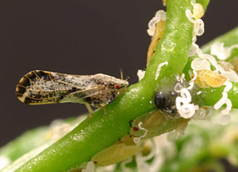

```{r setup, echo=TRUE, include=FALSE}
options(htmltools.dir.version = FALSE)

Sys.setenv(`_R_S3_METHOD_REGISTRATION_NOTE_OVERWRITES_` = "false")

output_dir <- "../../../../florida-hlb-model/spades_model/outputs/png/full/"
sim_time <- "2021-04-12 20-26-20"
knitr::opts_chunk$set(echo = FALSE)
sample <- readRDS("R/sample.rds")

uninf_sf <- readRDS(paste0("R/uninf_2.25_day_523.rds"))


library(terra); library(sf); library(mapdeck); 
library(stars); library(raster)
mapdeck::set_token("pk.eyJ1IjoibmNzaXplbW9yZSIsImEiOiJjazVweGhua3UwYWg2M2Ryem1iazllMzQzIn0.UnEMbbyS2sg-ygD8saJqQQ")


lst <- list.files(path = paste0(output_dir, sim_time), pattern = ".qs", full.names = TRUE)
rasts <- purrr::map(lst, ~ rast(qs::qread(.x)))

r <- rasts[[2]]

uninf <- r[[1]]
inf <- r[[2]]

uninf_st <- st_as_stars(raster(uninf))
uninf_sf <- st_as_sf(uninf_st, as_points = FALSE, merge = TRUE) %>% st_transform(crs = 4326)

inf_st <- st_as_stars(raster(inf))
inf_sf <- st_as_sf(inf_st, as_points = FALSE, merge = TRUE) %>% st_transform(crs = 4326)

light <- list(
  lightsPosition = c(-150, 75, 0)
  , numberOfLights = 1
  , ambientRatio = 0.2
)


```


# About

- PhD candidate, Mathematics, University of Florida
- Data analyst, Dept. of Emergency Medicine, University of Florida
- Lecturer, Dept. of Mathematics, Western Carolina University


### Research Interests 
- Applied/computational problems - theory and practice, esp:
  - Stochastic processes and modeling
  - ML/data science theory and interdisciplinary applications
  - Computationally driven mathematical theory

???

- Thanks for having me. 
- Going to speak briefly about recent work I've done involving stochastic modeling
- At the end, I'll say a little bit about Qnets for H5N1 - nothing deep or informative. Really just taken a basic look and can perhaps generate some discussions/questions.

---

class: center, middle, inverse

# Stochastic modeling of HLB

---

# HLB

[Huanglongbing](https://en.wikipedia.org/wiki/Citrus_greening_disease) (黃龍病), aka citrus greening disease

- Worldwide vector-borne disease affecting citrus
- Devastating bacterial infection: infected trees produce unusable green fruit, die early, and are economically unviable
- Vectored by *D. Citri* (psyllids); transmits to most commercial citrus cultivars (including ornamental orange jasmine)

.pull-left[
```{r, out.height = "298.5px", out.width="398px", echo = FALSE}
knitr::include_graphics("figures/symptomatic_leaves.png")
```
]

.pull-right[
```{r, out.height = "298.5px", out.width="398px", echo = FALSE}

```
]

???
- Known for at least 100 years
- possibly originated in India or China
- only recently (2000s) reached the Americas
---
# HLB in Florida

- spread rapidly statewide due to pre-existing vector population
- caused major disruption to the industry

### Economic consequences
- 49% reduction in citrus production
- thousands of jobs
- $\approx$ $1 billion per year estimated impact

.center[
```{r, echo = FALSE}

```
]

???

- For this work, focused specifically on the recent invasion/devastion in Florida
- Note that similar consequences have been observed worldwide in other regions

---
# Timeline of key events:

- 1997/1998: *Invasion* 
  - Psyllids arrive to SW Florida (Palm Beach County)
- Early 1999: *Dispersal* 
  - Psyllids continue dispersing urban corridor of SW Florida, reaching Homestead
- $\leq$ 1999: *Disease arrival*
  - Small number of *C*Las-positive plants arrive to Homestead
  - Psyllids acquire *C*Las in Homestead
- Early 2000s: *Major dispersal*
  - Widespread, statewide dispersal of uninfected psyllids
  - Initial spread of *C*Las
  - heavy infestation of commercial groves
- 2005: *Detection*
  - First finding of *C*Las in Florida
- By 2009: *Devastation* 
  - Widespread visible symptoms of infection and large blocks of citrus removed from production statewide


???

Some of the timeline is informed conjecture
---
# Objectives

To help mitigate risk in other locales, eg. CA, TX, AZ, need a more cohesive understanding of what happened (relative significance of factors driving the spread).

### Challenges

- high-dimensional system acting over large and varied spatial and temporal scales
- many underlying processes which are individually complex
- sparse, irregularly collected data (historical) 
  - not intended for rigorous analysis
- gaps in biological understanding
- undocumented management practices
- and many others...

### Goal
a comprehensive, realistic model with a small number of biologically-plausible assumptions that qualitatively generates the spread

???

Citrus is an important component of FL economy

- The above makes precise methods of quantitative model validation or parameter estimation unfeasible. 
- However, the above timeline at least offers some constraint on the set of possible models
- Again there is a need for a cohesive understanding of what exactly happened. 
- This motivates the development of a comprehensive, realistic model that uses a minimum of biologically-plausible assumptions to qualitatively reproduce the spread.

---
class: inverse, center, middle

# The Model


---

# Overview

### Structure/scope
- Stochastic; spatially explicit; discrete time/space
- Captures all major relevant processes statewide
  - From vector arrival in 1997/1998 until heavy loss of productive crop in $\approx$ 2009

### Resolution
- 0.25 $\times$ 0.25 mi (40 acre) grid overlaying the state; 1-acre resolution in commercial groves
- Fundamental time unit: days

### Philosophy
Make a limited number of biologically defensible assumptions to describe the underlying processes (and consistent with the known timeline)

???

- Primarily stochastic with some deterministic approximations
- Avoid overly complex mechanistic detail

---

# Dispersal Mechanisms

Some key processes captured by the model:

| Mechanism    | Implementation Details |
| ----------- | ----------- |
| Psyllid demography |  Seasonal (monthly) variation based on location and historical temperature data |
| "Natural" psyllid movement  | Convolution with local kernel; separate dispersal patterns in urban areas and commercial groves |
| Sales of citrus plants and hedges statewide to retail stores and then to consumers  | Fixed store locations; two-stage/layered Poisson process based on regional population   |
| Dispersal of psyllids via truck traffic to commercial processing plants | Harvesting process based on citrus density; routes sampled uniformly along paths to facilities |

???

Homestead, FL is a major center for nursery production and distributes plants statewide

---
# Tech Stack

- At these spatial scales (> 3 million grid cells), a significant part of the model are the convolutions used for dispersal daily
  - vector populations are stacked as tensors and we call TensorFlow for hardware accelerated performance
- On the front-end, the base model is called from R due to its excellent interface to high-level geospatial libraries

???

(brief, included because I find it interesting)
- shows that computer vision techniques have relevance for spatial modeling problems as well

---
# Samples

Examples of truck dispersal:

.pull-left[
```{r, out.width = "70%", echo = FALSE}

```
]

.pull-right[
```{r plot-sample, out.width = "100%", echo=FALSE}
leaflet::leaflet(st_transform(sample, crs = 4326) %>% st_cast("POINT") %>% as("Spatial")) %>% leaflet.mapboxgl::addMapboxGL(style = "mapbox://styles/mapbox/outdoors-v11", accessToken = "pk.eyJ1IjoibmNzaXplbW9yZSIsImEiOiJjazVweGhua3UwYWg2M2Ryem1iazllMzQzIn0.UnEMbbyS2sg-ygD8saJqQQ", setView = FALSE) %>%  leaflet::addCircleMarkers(weight = 1, fillOpacity = 0, radius = 3) %>% leaflet::setView(-81, 27, zoom = 8)
```
]

???

- Trucks are open, psyllids can easily fly out
- Sampled points show locations of dispersal from a truck

---
# Sample Output

Infected population after 10+ years of simulation:

.center[
```{r, out.width = "85%", echo = FALSE}

```
]
---
# Observations

The model suggests that:

- Natural vector movement generates significant (but not statewide) dispersal
  - Long-range natural dispersal occurs, but is not significant
- Human-driven factors (sales of plants, trucks) expedited the spread and enabled access to regions otherwise inaccessible (northern regions in particular)
- Traditional vector control mechanisms (eg. pesticides) have limited utility in containing the spread

???

- The price of addressing a complex problem with limited resources (data) is the strength of the results. 

---
class: inverse, middle, center

# H5N1 Quasinets: <br/>Visualizing with Clustermaps

---
# Objectives

For purposes of exploring H5N1 hemagglutinin sequences (sourced from [NCBI](https://www.ncbi.nlm.nih.gov/labs/virus/vssi/#/virus?SeqType_s=Nucleotide&VirusLineage_ss=H5N1%20subtype,%20taxid:102793&ProtNames_ss=hemagglutinin)) in a Qnet framework, we:

- Construct a Q-net
- Look at the Q-distance matrix
- Visualize using `seaborn.clustermap()`

???
Useful framework for generating biologically meaningful distances b/w sequences and estimating mutation probabilities.

---
# H5N1 experiment

Took 200 recently collected H5N1 hemagglutinin nucleotide sequences

- Hosts: *Gallus gallus* (chickens) sequences collected in Asia
- Aligned, kept all features
- Generated Qnet using `quasinet.qnet.Qnet()`
- Got distance matrix using `quasinet.qnet.qdistance_matrix()`

To compare, also took a wider cohort of 200 H5N1 protein sequences from:
- Any species
- All geographic regions

---
# *Gallus gallus*-hosted clustermap

- Vast majority of sequences are tightly clustered wrt q-distance

.center[
```{r, out.height = "500px", out.width="500px", echo = FALSE}

```
]

---
# Multi-species protein clustermap

- Similar results, though a bit more variation:

.center[
```{r, out.height = "500px", out.width="500px", echo = FALSE}

```
]

???

- Wanted to look at membership degrees, but didn't seem to give reasonable results

---
class: center, middle, inverse
# Thanks!

???
- Didn't read the paper in a lot of detail
- qnet is a set of predictors for each index, mapping the values at other indices to a distribution for that index
- $\text{Pr}(x \in P)$ means product of probabilities of each component under the qnet's predictors at each component (so it seems to not be the actual probability of being the population $P$)
- membership *probability* is for arbitrary sequences; membership *degree* is for sequences known to be from the base population
- difference b/w populations implies different marginals (and different realized predictors)
- if prob. of observing membership degree greater than whatever is small, we reject the null
